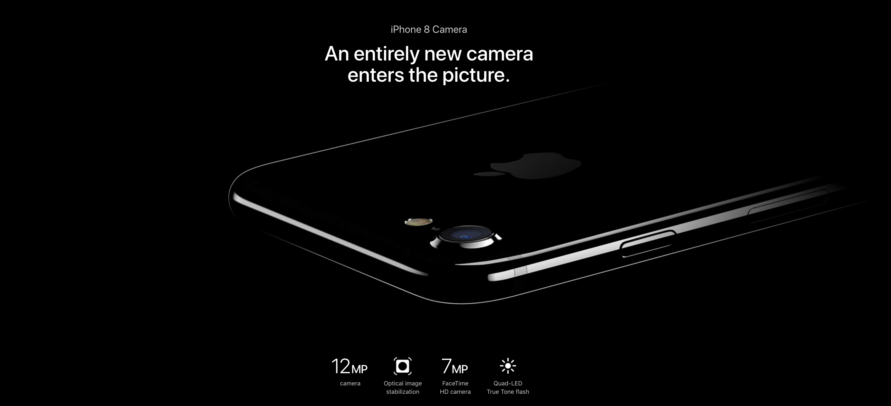

## Contexto

Muito bem, já sabemos o caminhos das pedras pra colocarmos nosso MVP em Produção.
Ok... ainda tem muita coisa a ser melhorada nesse caminho, porém precisamos lançar nossa página de campanha para gerar uma ansiedade em nossos clientes!

## Objetivo

Lançar página de campnha do nosso produto!

## Pré Requisitos

* Desafios passados

## Conceitos e Pontos Importantes

* HTML e CSS
* Como alterar o HTML da página do iPhone 7 pra trocar pra 8 xD
* Fazer deploy manual novamente

## Resultado esperado

Visualizar página com o produto conforme detalhes abaixo:

### Imagens:
* [Banner](https://images.apple.com/v/iphone-7/d/images/overview/hero_fallback_large.png)
* [Camera](https://images.apple.com/v/iphone-7/d/images/overview/camera_hero_large.jpg)
* [Display](https://images.apple.com/v/iphone-7/d/images/overview/display_hero_large.jpg)
